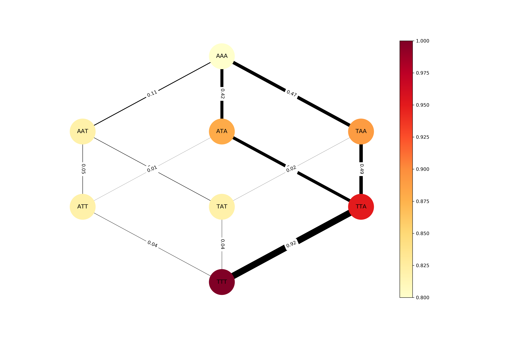

``gpvolve``
===========

Introduction
------------

A Python API for the simulation and analysis of evolution in genotype-phenotype space.
You can use this library to:

   1. Build a markov state model from a genotype-phenotype-map.
   2. Find clusters of genotypes that represent metastable states of the system, using PCCA+.
   3. Compute fluxes and pathways between pairs of genotypes and/or clusters of interest, using Transition Path Theory.
   4. Visualize the outputs of all of the above.

The core-utilities of this library are built on top of the pyemma and msmtools packages.
For a deeper understanding of these tools, we recommend reading the docs and scientific
references of the respective libraries ([1]_, [2]_, [3]_).

A rationale for treating fitness landscapes as markov systems can be found in [4]_.

Currently, this package works only as an API. There is no command-line
interface. Instead, we encourage you use this package inside `Jupyter notebooks`_ .

References
----------

.. [1] https://github.com/markovmodel/PyEMMA
.. [2] https://github.com/markovmodel/msmtools
.. [3] M K Scherer, B Trendelkamp-Schroer, F Paul, G Pérez-Hernández, M Hoffmann, N Plattner, C Wehmeyer, J-H Prinz and F Noé: PyEMMA 2: A Software Package for Estimation, Validation, and Analysis of Markov Models, J. Chem. Theory Comput. 11, 5525-5542 (2015)
.. [4] G Sella, A E Hirsh: The application of statistical physics to evolutionary biology, Proceedings of the National Academy of Sciences Jul 2005, 102 (27) 9541-9546; DOI: 10.1073/pnas.0501865102

Basic Example
-------------

Calculate and plot the fluxes between wildtype and triple mutant on an example genotype-phenotype map.

.. code-block:: python

   # Import base class, Transition Path Theory class and functions for building Markov Model.
   from gpvolve import GenotypePhenotypeMSM, TransitionPathTheory, linear_skew, mccandlish, find_max
   # Import visualization tool.
   from gpvolve.visualization import plot_network
   # Import GenotypePhenotypeMap class for handling genotype-phenotype data.
   from gpmap import GenotypePhenotypeMap
   # Helper functions.
   from scipy.sparse import dok_matrix

   # Genotype-phenotype map data.
   wildtype = "AAA"
   genotypes = ["AAA", "AAT", "ATA", "TAA", "ATT", "TAT", "TTA", "TTT"]
   phenotypes = [0.8, 0.81, 0.88, 0.89, 0.82, 0.82, 0.95, 1.0]

   # Instantiate Markov model class.
   gpm = GenotypePhenotypeMap(wildtype=wildtype,
                              genotypes=genotypes,
                              phenotypes=phenotypes)

   # Instantiate a evolutionary Markov State Model from the genotype-phenotype map.
   gpmsm = GenotypePhenotypeMSM(gpm)

   # Map fitnesses to phenotypes.
   gpmsm.apply_selection(fitness_function=linear_skew, selection_gradient=1)

   # Build Markov State Model based on 'mccandlish' fixation probability function.
   gpmsm.build_transition_matrix(fixation_model=mccandlish, population_size=100)

   # Find global fitness peak.
   fitness_peak = find_max(gpmsm=gpmsm, attribute='fitness')

   # Compute fluxes from wildtype to fitness peak.
   fluxes = TransitionPathTheory(gpmsm, source=[0], target=[fitness_peak])

   # Normalize flux.
   norm_fluxes = fluxes.net_flux/fluxes.total_flux

   # Plot the network and the fluxes
   fig, ax = plot_network(gpmsm,
                          flux=dok_matrix(norm_fluxes),
                          edge_labels=True,
                          colorbar=True)

Documentation
-------------
.. toctree::
   :maxdepth: 2

   pages/quick_guide
   api/main

