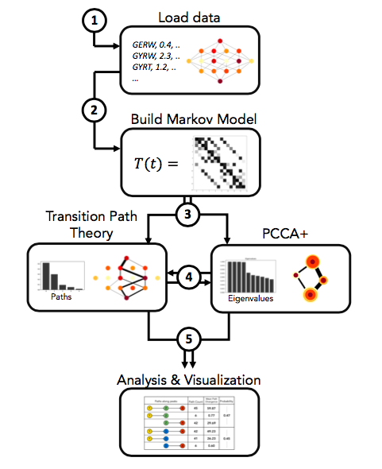
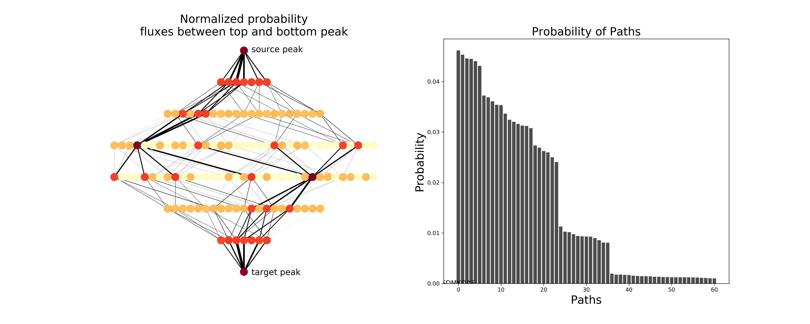
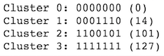
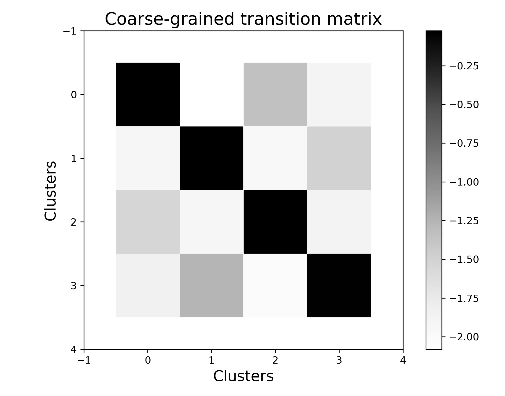
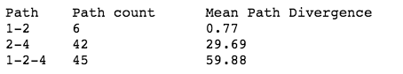

Quick Guide
===========

Introduction
------------

``gpvolve`` is a Python API that allows the user to analyze genotype-phenotype data with tools from chemical physics.
Using the library, you can:

   1. Build a markov state model from a genotype-phenotype-map.
   2. Find clusters of genotypes that represent metastable states of the system, using PCCA+.
   3. Compute fluxes and pathways between pairs of genotypes and/or clusters of interest, using Transition Path Theory.
   4. Visualize the outputs of all of the above.

Computational Pipeline
----------------------

The tools included in the ``gpvolve`` API can be combined into a computational pipeline which simplifies the repetition
of analyzes. We recommend using Jupyter notebooks for this purpose.

In the following example we will to go through the 5 steps shown in the figure above. We note that the pipeline is
modular, meaning that all steps except step 1 and step 2 can be executed in any desired order.

Example
-------

Import functions.

.. code-block:: python

    # Import gpvolve functions explicitly.
    from gpvolve import GenotypePhenotypeMSM
    from gpvolve.fitness import one_to_one
    from gpvolve.fixation import mccandlish
    from gpvolve.flux import TransitionPathTheory
    from gpvolve.visualization import plot_network, plot_matrix
    from gpvolve.paths import flux_decomp
    from gpvolve.utils import *
    from gpvolve.cluster.pcca import PCCA
    from gpvolve.cluster.base import GenotypePhenotypeClusters
    from gpvolve.cluster.utils import *
    from gpvolve.analysis.pathways import *

    # Import gpmap for genotype-phenotype data handling
    from gpmap.simulate import MultiPeakMountFujiSimulation, MountFujiSimulation

    # Helper and plotting functions.
    import matplotlib.pyplot as plt
    from scipy.sparse import dok_matrix
    import pickle

**Load data.**

Simulate 7-site map with 4 fitness peaks. Can also import exisiting genotype-phenotype data here.
See the gpmap Python package for more information (https://github.com/harmslab/gpmap)

.. code-block:: python

    gpm = MultiPeakMountFujiSimulation.from_length(7, peak_n=4, min_dist=2, roughness_width=0.2, field_strength=1)

**Build Markov model.**

First we need to **map a fitness** value onto each phenotype. In this example we simple use phenotype values as fitnesses.
The user can also pass their own fitness function here.

.. code-block:: python

    evomsm.apply_selection(one_to_one)

Building the transition matrix requires the user to define a **fixation probability** function and all its required
parameteres. Here, we use the fitness function by McCandlish (McCandlish, 2011) and a population size of 10.

.. code-block:: python

    evomsm.build_transition_matrix(mccandlish, population_size=10)

**Transition Path Theory**

Having built an evolutionary Markov model of the genotype-phenotype map, we can use Transition Path Theory to compute
reactive flux that moves from the wild type to the 7-site mutant.

.. code-block:: python

    # Compute reactive flux between wild type and 7-site mutant.
    tpt = TransitionPathTheory(evomsm, [0], [127])

Now we can use the reactive flux to compute the pathways that go from genotype 0 (0000000) to 127 (1111111) and their relative probabilities.

.. code-block:: python

    paths = tpt.ReactiveFlux.pathways()

**Visualize Transition Path Theory output.**

.. code-block:: python

    # Sort path probabilities
    path_probabilitities = sorted(paths[1], reverse=True)

    # Normalize all paths with probability > 0.001.
    prob_sum = sum(path_probabilitities)
    norm_path_probabilities = [prob/prob_sum for prob in path_probabilitities if prob/prob_sum > 0.001]
    x = range(len(norm_path_probabilities))

    # Draw figure
    figsize=(20,8)
    fig, (ax1, ax2) = plt.subplots(1, 2, figsize=figsize)

    # Plot genotype-phenotype map as network.
    plot_network(evomsm, ax=ax1, figsize=figsize, node_size=200, flux=dok_matrix(tpt.net_flux/tpt.total_flux))

    ax1.set_title("Normalized probability\nfluxes between top and bottom peak", size=20)
    ax1.text(1,-0.05, "source peak", size=15)
    ax1.text(1,-7.1, "target peak", size=15)

    # Plot the probabilities of the most likely paths.
    ax2.bar(x, norm_path_probabilities, color='0.3')

    ax2.set_xlabel("Paths", size=20)
    ax2.set_ylabel("Probability", size=20)
    ax2.set_title("Probability of Paths", size=20)

**Coarse-grain genotype-phenotype map using PCCA+.**

Next, we use Robust Perron-Cluster Cluster Analysis (PCCA+) to coarse-grain the genotype-phenotype map.

.. code-block:: python

    # Cluster genotype-phenotype map into 4 clusters.
    pcca = PCCA(evomsm, 4)

Since PCCA+ might not return the 4 clusters in the order that we prefer, we have to reorder the clusters.

.. code-block:: python

    # Find peaks and order them.
    peaks = sorted([list(peak)[0] for peak in evomsm.peaks()])

    # Reorder the pcca clusters according to the peak they contain.
    ord_clusters = sort_clusters_by_nodes(pcca.clusters, peaks)

    # We simply instantiate a new object for the newly sorted clusters
    clustering = GenotypePhenotypeClusters(evomsm, ord_clusters)

    # Memberships won't be in order but can be reordered using the command below
    reordered_row = pcca.memberships[clustering.order, :]
    reordered_mem = reordered_row[:, [0,1,3,2]]
    clustering.memberships = reordered_mem

    # Check if sorting was correct by finding the peak in each cluster.
    string = ""
    for i, cluster in enumerate(clustering.clusters):
        for peak in peaks:
            if peak in cluster:
                string = string + "Cluster %s: %s (%s)\n" % (i, clustering.gpmsm.gpm.data.binary[peak], peak)
    print(string)

**Visualize the metastability of the coarse-grained genotype-phenotype map.**

If we plot the coarse transition matrix, we see that most of the transition probability is located at the
diagonal, i.e. transitions that happen within a cluster are more likely than transitions between clusters.
The colorbar on the right is in log10(transition probability).

.. code-block:: python

    # Plot coarse-grained transition matrix.
    fig, ax = plt.subplots(figsize=(7,5.5))
    header = 17
    ax_labels = 15

    plot_matrix(clustering.transition_matrix, ax=ax, colorbar=True)
    ax.set_title("Coarse-grained transition matrix", size=header)
    ax.set_ylabel("Clusters", size=ax_labels)
    ax.set_xlabel("Clusters", size=ax_labels)
    ax.set_aspect("equal")

    plt.tight_layout()

**Analyze evolutionary mechanisms along fitness peaks.**

Finally, we can analyze evolutionary trajectories that pass genotypes of interest. In this example we will look at the
trajectories that pass through peak 2 on their way to peak 4 (1-2-4). We split the trajectories
into the part between peak 1 and 2 and the part between peak 2 and 4. We find that the sub-trajectories between 2 and 4 are
much less constrained than the ones between 1 and 2, which we quantify by calculating the mean path divergence.

.. code-block:: python

    # First get normalized path probabilities as dict
    path_probs = paths_and_probs_to_dict(paths[0], paths[1], normalize=True)
    all_paths = list(path_probs.keys())

    # Path 1-2-4
    paths124 = paths_that_do_not_contain(paths_that_contain(all_paths, [0,14,127], bool_and=True), [101])
    paths124_probs = {path: path_probs[path] for path in paths124}
    mpd124 = mean_path_divergence(evomsm, paths124_probs)
    entr124 = entropy(list(paths124_probs.values()))

    ## Segment 1-2
    paths124_12 = get_sub_paths(paths124_probs, 0, 14)
    mdp124_12 = mean_path_divergence(evomsm, paths124_12)
    ## Segment 2-4
    paths124_24 = get_sub_paths(paths124_probs, 14, 127)
    mdp124_24 = mean_path_divergence(evomsm, paths124_24)

    print("Path\tPath count\tMean Path Divergence\n%s\t%s\t\t%s\n%s\t%s\t\t%s\n%s\t%s\t\t%s" % ("1-2", len(paths124_12), round(mdp124_12,2), "2-4", len(paths124_24), round(mdp124_24,2), "1-2-4", len(paths124), round(mpd124, 2)))

Installation and Dependencies
-----------------------------

Installation
~~~~~~~~~~~~

User can clone the github repository and install it locally.

.. code-block:: bash

    git clone https://github.com/harmslab/gpvolve
    cd gpvolve
    pip install -e .

Dependencies
~~~~~~~~~~~~

The following dependencies are required for the ``gpvolve`` package.

* gpmap_: Module for constructing powerful genotype-phenotype map python data-structures.
* gpgraph_: Module for graphic representation of genotype-phenotype maps built on top of networkx.
* networkx_: Python package for construction and analysis of networks and graphs.
* msmtools_: Python package containing tools for construction and analysis of markov models, including Transition Path Theory and PCCA+.
* numpy_: Python's array manipulation package.
* cython_: Programming language written in Python with C-like performance.
* matplotlib_: Python plotting library.

.. _gpmap: https://github.com/harmslab/gpmap
.. _gpgraph:: https://github.com/harmslab/gpgraph
.. _networkx: https://github.com/networkx
.. _msmtools: https://github.com/markovmodel/msmtools
.. _numpy: http://www.numpy.org/
.. _cython: https://github.com/cython/cython
.. _matplotlib: http://matplotlib.org/
